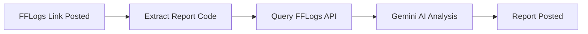

# 📊 Discord AI Raid Reporter

Automatically generate AI-powered raid performance reports from FFLogs links.

A Discord bot that detects [FFLogs](https://www.fflogs.com/) links, queries the FFLogs GraphQL API for structured fight data, and sends it to Google Gemini AI for analysis — posted directly into your Discord server.


---

## ✨ Features

- 🔗 **Auto-Detection** — Listens for FFLogs links in a designated channel
- 📡 **FFLogs GraphQL API** — Queries structured fight data (damage, healing, deaths)
- 🤖 **AI Analysis** — Google Gemini 2.5 Flash generates detailed reports
- 📊 **Discord Formatted** — Reports use markdown with summaries, stats, and recommendations
- ✂️ **Smart Splitting** — Long reports are split at line boundaries to preserve formatting

---

## 🎥 Demo

[](https://youtu.be/sjbn3MEzjg4)

---

## 🎬 How It Works



1. A user posts an FFLogs link in the **input channel**
2. The bot extracts the report code from the URL
3. The **FFLogs GraphQL API** is queried for fight data
4. Structured data is sent to **Google Gemini** for analysis
5. The report is posted in the **output channel**

---

## 📦 Setup

### Prerequisites

- Python 3.10+
- [Discord Bot](https://discord.com/developers/applications) with **Message Content** intent enabled
- [Google Gemini API Key](https://aistudio.google.com/apikey)
- [FFLogs API Client](https://www.fflogs.com/api/clients) (V2 — Client ID & Secret)

### Installation

```bash
git clone https://github.com/BenBrady96/discord-ai-raid-reporter.git
cd discord-ai-raid-reporter

python -m venv venv
venv\Scripts\activate     # Windows
source venv/bin/activate  # Linux/Mac

pip install -r requirements.txt

cp .env.example .env
# Edit .env with your credentials
```

### Running

```bash
python main.py
```

---

## ⚙️ Configuration

### Environment Variables

| Variable | Description |
|---|---|
| `DISCORD_TOKEN` | Discord bot token |
| `GEMINI_API_KEY` | Google Gemini API key |
| `FFLOGS_CLIENT_ID` | FFLogs V2 API client ID |
| `FFLOGS_CLIENT_SECRET` | FFLogs V2 API client secret |
| `INPUT_CHANNEL_ID` | Channel where FFLogs links are posted |
| `OUTPUT_CHANNEL_ID` | Channel where reports are sent |

### Required Bot Permissions

- Read Messages
- Send Messages
- Read Message History

---

## 🏗️ Project Structure

```
discord-ai-raid-reporter/
├── cogs/
│   └── raid_reporter.py   # FFLogs link detection + Gemini analysis
├── utils/
│   └── fflogs_client.py   # FFLogs OAuth2 + GraphQL client
├── main.py                # Bot entry point
├── requirements.txt
├── .env.example
├── .gitignore
└── LICENSE
```

---

## 📄 License

MIT - see [LICENSE](LICENSE) for details.

---

## 📧 Contact

- [GitHub](https://github.com/BenBrady96)
- [LinkedIn](https://www.linkedin.com/in/ben-brady-b241642b4/)


